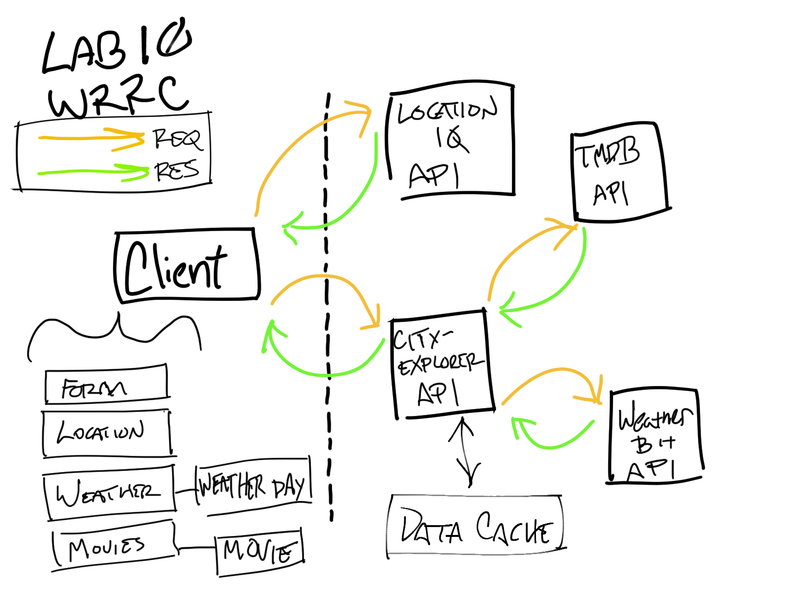

# City Explorer

**Author**: Micha Davis

**Version**: 1.3.1 

## Overview
The Internet brings us a new way to explore the world from the comfort of one's home. This simple app engages that digital wanderlust by providing a simple birds-eye view of any location the user might care to look upon.

## Getting Started
Enter a place name into the search bar and click the `Explore!` button.

## Architecture
Built with React and React-Bootstrap with JS and JSX, with data from the LocationIQ API.

## Change Log
Name of feature: #1 - Set up repository & API keys

Estimate of time needed to complete: 20min

Start time: 2/21/22 @2:15pm

Finish time: 2/21/22 @2:32pm

Actual time needed to complete: 17min

---

Name of feature: #2 - Set up calls to API and response handling

Estimate of time needed to complete: 60min

Start time: 2/21/22 @ 2:35pm

Finish time: 2/21/22 @ 4:35pm

Actual time needed to complete: 90min (+15 min break +15min meeting)

---

Name of feature: #3 - Render map and data, style

Estimate of time needed to complete: 15min

Start time: 2/21/22 @ 4:40pm

Finish time: 2/21/22 @ 4:50pm

Actual time needed to complete: 10min

---

Name of feature: #4 - Error handling for invalid or empty location

Estimate of time needed to complete: 45min

Start time: 2/21/22 @ 5:00pm

Finish time: 2/21/22 @ 5:50pm

Actual time needed to complete: 50min

---

Name of feature: #5 - Movies display

Estimate of time needed to complete: 45min

Start time: 2/23/22 @ 8:20pm

Finish time: 2/23/22 @ 8:55pm

Actual time needed to complete: 35min

---

Name of feature: #6 - Componentize front-end codebase

Estimate of time needed to complete: 25min

Start time: 2/24/22 @ 2:15pm

Finish time: 2/24/22 @ 2:30pm

Actual time needed to complete: 15min

## Credit and Collaborations
* [LocationIQ](https://locationiq.com/)
* Collab with Rey Mercado, Michael Campbell, Matt Rangel on WRRC diagram
